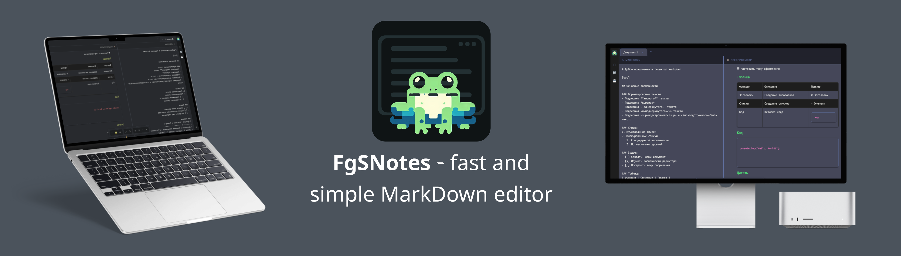
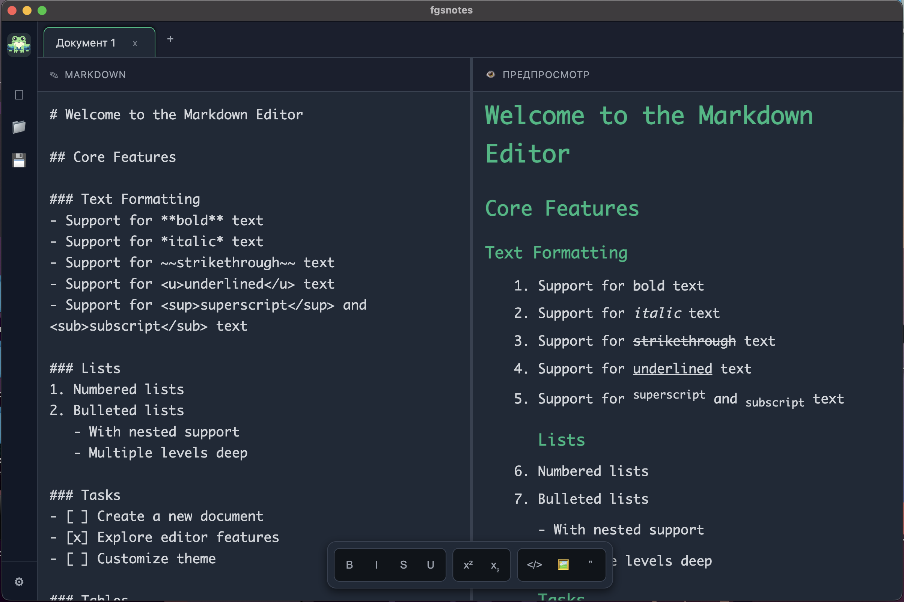

# 📝 FgSNotes - Markdown Editor

[](https://electronjs.org/) [](LICENSE)  [](https://github.com/your-username/MarkdownEditor)  

**FgSNotes** - a cross-platform application for creating, editing, and viewing markdown documents  
  


## 🌐 Official Website

Visit the [official FgSNotes website](https://fgsnotes.com) for the latest news, documentation, and additional resources.  


## 📥 Download

### From GitHub Releases
1. Go to the [Releases](https://github.com/your-username/MarkdownEditor/releases) section
2. Select the latest version
3. Download the file for your operating system:
   - **macOS**: `FgSNotes-x.x.x.dmg`
   - **Windows**: `FgSNotes-x.x.x.exe` or `FgSNotes-x.x.x-portable.exe`
   - **Linux**: `FgSNotes-x.x.x.AppImage`


### From the Official Website
1. Open [fgsnotes.com](https://fgsnotes.com)
2. Click the "Download" button
3. Choose the version for your platform
4. Follow the installation instructions


### Installation

#### macOS
1. Open the downloaded `.dmg` file
2. Drag the application to the Applications folder
3. Launch FgSNotes from the Applications folder


#### Windows
1. Run the `.exe` file
2. Follow the installer instructions
3. Or use the portable version without installation


#### Linux
1. Make the `.AppImage` file executable: `chmod +x FgSNotes-x.x.x.AppImage`
2. Run the file: `./FgSNotes-x.x.x.AppImage`  


## ✨ Features

### 🎨 Modern Interface


## ✨ Capabilities

- Support for most markdown elements
- Themes: Choose from a variety of themes or create your own. Themes are applied to the editor.
- Document preview: Instant display of results in the adjacent panel.
- Lightweight and fast: The editor is lightweight and quick, allowing you to work in multiple tabs simultaneously.
- Plugin system (in development)


### 📝 Markdown Editing
- **Real-time syntax highlighting**
- **Toolbar** with buttons for quick formatting
- **Support for all major Markdown elements:**
  - Headings (H1-H6)
  - Bold, italic, strikethrough text
  - Lists (bulleted and numbered)
  - Links and images
  - Code blocks and inline code
  - Quotes
  - Tables
  - Tasks (todo lists)


### 🔧 Settings and Customization
- **Font size and type** (system, monospace, serif, sans-serif)
- **Line spacing** (narrow, medium, wide)
- **Tab size** (2, 4, 8 spaces)
- **Word wrap** (on/off)
- **Auto-save** (every minute, 5 minutes, 10 minutes)
- **Preview themes** (default, GitHub, dark)
- **Support for third-party CSS themes**


### 🎨 Theme Store
Visit the [FgSNotes theme store](https://fgsnotes.com/themes) to download additional themes. Available themes for:
- **Editor** - change the appearance of the editing area
- **Preview** - style the displayed content
- **Interface** - complete customization of the application  


## 🖼️ Screenshots

  
*Main interface of the editor with a split view for editing and preview*  


## 🚀 Installation and Launch

### Prerequisites
- [Node.js](https://nodejs.org/) (version 14 or higher)
- [npm](https://www.npmjs.com/) or [yarn](https://yarnpkg.com/)  


### Installing Dependencies
```bash
npm install
```


### Running in Development Mode
```bash
npm start
```


### Building the Application

#### For macOS (Intel)
```bash
npm run build:mac-intel
```


#### For Windows (32-bit)
```bash
npm run build:win32
```


#### For All Platforms
```bash
npm run build:all
```  


## 📁 Project Structure

```
MarkdownEditor/
├── src/                    # Source code of the application
│   ├── MarkDownEditor.html # Main HTML file
│   ├── styles.css         # Application styles
│   ├── editor.js          # Editor logic
│   ├── settings.js        # Settings management
│   ├── theme.js           # Theme system
│   ├── resize.js          # Resize handling
│   ├── icon.png           # Application icon
│   └── logo.png           # Logo
├── main.js                # Main Electron process
├── preload.js             # Preload script
├── package.json           # Project configuration
└── README.md              # Documentation
```  


## 🛠️ Technology Stack

### Core Technologies
- **[Electron](https://electronjs.org/)** - framework for building cross-platform desktop applications
- **[Node.js](https://nodejs.org/)** - JavaScript runtime environment on the server side
- **[HTML5](https://developer.mozilla.org/en-US/docs/Web/HTML)** - markup for the user interface
- **[CSS3](https://developer.mozilla.org/en-US/docs/Web/CSS)** - styling and animations
- **[Vanilla JavaScript](https://developer.mozilla.org/en-US/docs/Web/JavaScript)** - application logic without frameworks  


## Supported Platforms
- **macOS** (x64) - native support with DMG installer
- **Windows** (x86/x64) - NSIS installer and portable version
- **Linux** - AppImage format for universal compatibility  


## 🎯 Usage

### Main Functions

1. **Create a new document**: Click the "New File" button in the sidebar
2. **Open a file**: Use the "Open File" button to load .md files
3. **Save**: Click "Save File" or use auto-save
4. **Preview**: The result is displayed in the right panel in real-time  


### Keyboard Shortcuts

- `Ctrl/Cmd + S` - Save file
- `Ctrl/Cmd + O` - Open file
- `Ctrl/Cmd + N` - New file
- `Ctrl/Cmd + ,` - Open settings  


### Markdown Syntax

```markdown
# Heading 1
## Heading 2

**Bold text** and *italic*

- Bulleted list
- [ ] Task
- [x] Completed task

1. Numbered list
2. Second item

> Quote

`inline code`

```javascript
// code block
console.log('Hello World');
```


## ⚙️ Settings

The application automatically creates a folder `FgSNotes` in the user's documents with the following structure:

```
Documents/FgSNotes/
├── config.json    # Application settings
├── themes/        # User-defined CSS themes
└── plugins/       # Plugins (future functionality)
```  


### Installing Third-Party Themes
1. Download the `.css` theme file from the [theme store](https://arduradiokot.github.io/FgSNotes/themes.html)
2. Copy the file to the `Documents/FgSNotes/themes/` folder
3. Restart the application
4. Select the theme in the settings  


#### Method 3: Creating Your Own Theme
1. Create a `.css` file in the `themes/` folder
2. Use the following CSS selectors:
   ```css
   /* Styles for the editor */
   #markdown-editor { }
   
   /* Styles for the preview */
   #preview { }
   
   /* Styles for the interface */
   .editor-page { }
   ```
3. Save the file and restart the application  


### Configuration File

```json
{
  "theme": "dark",
  "font-size": "medium",
  "font-family": "mono",
  "line-height": "1.6",
  "tab-size": "4",
  "word-wrap": "on",
  "auto-save": "5",
  "preview-theme": "default",
  "math-support": "on",
  "table-of-contents": "on",
  "todo-list": "on",
  "code-highlight": "on",
  "external-theme": ""
}
```  


### Adding New Features

1. **New Markdown Elements**: Edit the `parseMarkdown()` function in `editor.js`
2. **New Settings**: Add parameters in `main.js` and `settings.js`
3. **New Themes**: Create a CSS file in the `themes/` folder  


## 🤝 Contributing to the Project

We welcome contributions to the project! Please:

1. Fork the repository
2. Create a branch for your new feature (`git checkout -b feature/amazing-feature`)
3. Commit your changes (`git commit -m 'Add amazing feature'`)
4. Push to the branch (`git push origin feature/amazing-feature`)
5. Open a Pull Request  


## 📄 License

This project is licensed under the GPL-2.0 license. See the [LICENSE](LICENSE) file for more information.