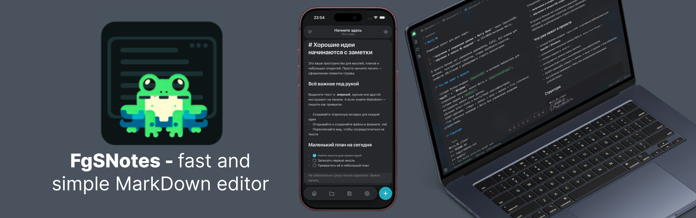

# FgSNotes

[](https://electronjs.org/) [](LICENSE) [](https://github.com/ArduRadioKot/FgSNotes)

FgSNotes is a desktop Markdown editor built with Electron. The application combines an editor and a live preview, so you can see the rendered document while working on it.



## Features

- create, open, and save Markdown files;
- work with multiple documents in tabs;
- switch between Editor, Split, and Preview modes;
- preview Markdown in real time;
- use the formatting toolbar for headings, emphasis, lists, quotes, links, images, and code blocks;
- configure the font, text size, line spacing, tab size, and word wrapping;
- switch the interface and preview themes;
- resize the editor and preview panels.

## Running from Source

Node.js and npm are required.

```bash
npm install
npm start
```

The application window starts with `npm start`.

## Tests

```bash
npm test
```

Tests are located in the `tests/` directory and use Node.js's built-in test runner.

## Building

To create a local unpacked build:

```bash
npm run dist
```

The following commands create installers and archives:

```bash
npm run build:mac       # macOS, arm64 and x64
npm run build:win       # Windows, x64 and ia32
npm run build:linux     # Linux, x64
npm run build:all       # all supported platforms
```

The build commands use Electron Builder. Output is written to the `dist/` directory.

## Keyboard Shortcuts

| Action       | macOS     | Windows/Linux |
| ------------ | --------- | ------------- |
| New document | `Cmd + N` | `Ctrl + N`    |
| Open file    | `Cmd + O` | `Ctrl + O`    |
| Save file    | `Cmd + S` | `Ctrl + S`    |
| Bold text    | `Cmd + B` | `Ctrl + B`    |
| Italic text  | `Cmd + I` | `Ctrl + I`    |

## Project Structure

```text
main.js                 Electron main process
preload.js              Secure bridge between processes
src/MarkDownEditor.html Application markup
src/editor.js           Document and preview handling
src/markdown.js         Markdown processing
src/settings.js         Editor settings
src/theme.js            Interface themes
src/resize.js           Panel resizing
src/highlight.js        Syntax highlighting
src/styles.css          Application styles
tests/                  Automated tests
```

## License

The project is distributed under the license specified in [LICENSE](LICENSE).

## Mobile app (Capacitor)

The same web code runs as an iOS and Android app. Capacitor config: `capacitor.config.json`, native projects: `ios/` and `android/`.

```bash
npm run cap:sync   # build www/ from src/ and copy it into both native projects
npm run ios        # sync and open Xcode
npm run android    # sync and open Android Studio
```

Phones use a one-pane layout with a bottom action bar. Saving opens the system share sheet (Save to Files); Liquid Glass and the theme store are desktop-only. Building for iOS needs Xcode, for Android needs Android Studio with the SDK.

### Install on an iPhone over a cable

1. `npm run ios` (builds the web part, syncs it and opens Xcode).
2. In Xcode choose the **App** target → **Signing & Capabilities**: tick *Automatically manage signing* and pick your team (a free Apple ID works).
3. Connect the iPhone, unlock it, tap **Trust**, and turn on **Settings → Privacy & Security → Developer Mode** (the phone restarts).
4. Choose your iPhone at the top of Xcode and press **Run**.
5. First launch: **Settings → General → VPN & Device Management** → your Apple ID → **Trust**. With a free Apple ID the build stops working after 7 days; run it again to renew.

Icons and splash screens for iOS and Android are generated from `src/icon.png` with `npm run icons` (needs ImageMagick), then `npm run cap:sync`.
